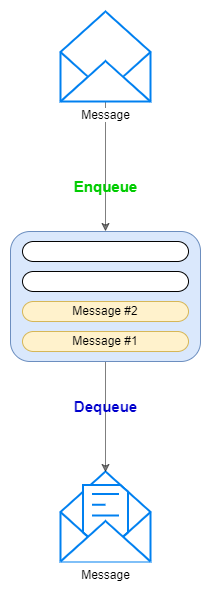
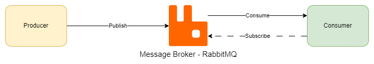
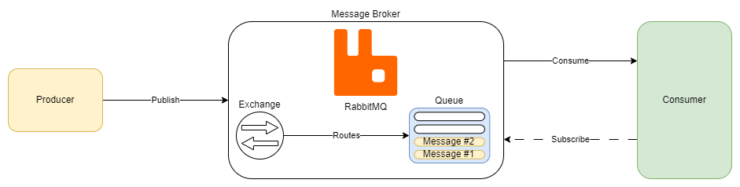
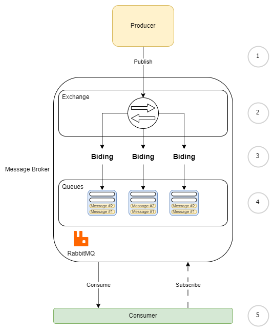
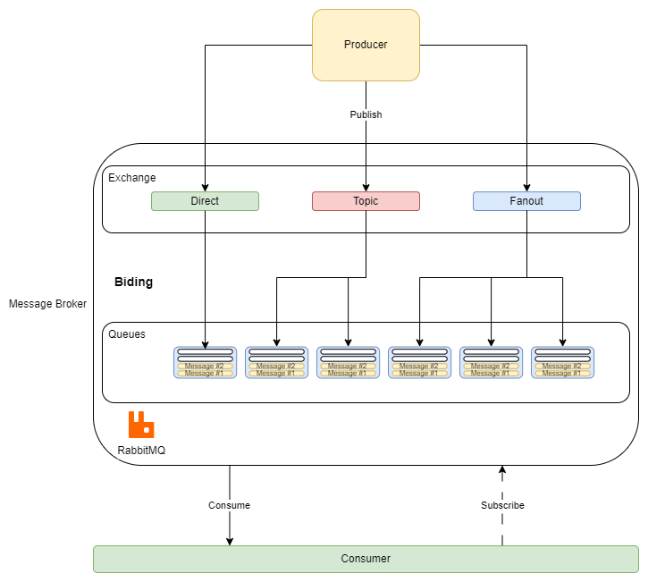

# RabbitMQ overview and examples <!-- omit in toc -->

## Contents <!-- omit in toc -->

- [1. Introduction](#1-introduction)
- [2. How how RabbitMq delivers messages](#2-how-how-rabbitmq-delivers-messages)
- [3. Exchanges](#3-exchanges)
  - [3.1. Exchange types](#31-exchange-types)
    - [3.1.1. Direct exchange](#311-direct-exchange)
    - [3.1.2. Topic exchange](#312-topic-exchange)
    - [3.1.3. Fanout](#313-fanout)

# 1. Introduction

- RabbitMq is a message queuing software is popular amongst Dotnet developers.
- It is also known as a message broker which is open source and successful at accepting and forwarding messages.
- In this analogy RabbitMq is a postbox, a post office, and a postman.

# 2. How how RabbitMq delivers messages

- A message can include any kind of information for example:
  - Simple text message.
  - Image to converted to a byte array
  - Process or task that should kick off in another application which could even be on another server.
- The message broker software stores the messages until the receiving application connects and takes a message off the queue.
- The receiving application then processes the message.
  - A message broker acts as a middle man for various services.

# 3. Exchanges

- In fact in RabbitMq, messages are **not published directly to a queue**.
  - Instead, the producer sends messages to an exchange.
    - **The exchange is responsible for routing the messages to different queues** with the help of bindings and routing keys.
- **A binding** is a link between a queue and an exchange.

  1. The producer publishes or sends a message to an exchange.
  2. When creating an exchange, the message type must be specified.
  3. The exchange receives the message and is now responsible for routing the message.
  4. The exchange takes different message attributes into account such as the routing key depending on the exchange type.
  5. **Bindings** must be created from the exchange to queueus.
  6. In this case there are two bindings to two different queues from the exchange.
  7. The exchange routes the message into the queues depending on message attributes.
  8. The message attributes should contain the key for the message to find its destination.
  9. The messages stay in the queue until they are handled.
  10. And lastly the consumer handles the message.

## 3.1. Exchange types

### 3.1.1. Direct exchange

- The message is routed to the queue whose binding key exactly matches the routing key of the message.
- For example if the queue is bound to the exchange with the binding key "imageprocess", a message published to the exchange with a routing key "imageprocess" is routed to that queue.

### 3.1.2. Topic exchange

- The message from an exchange to the relevant queue or queues find their way via a wild card match between the routing key and the routing patterns specified in the binding.

### 3.1.3. Fanout

- In this type of exchange, the messages are delivered to all the queues.
